# AI Briefing 🚀

AI駆動開発（Gemini API/CLI、Antigravity など）、Web技術、自動テスト（Playwright など）に関連する重要記事を、指定されたRSSフィードから自動で収集・選定（キュレーション）し、Slackへ通知するボットです。



## 概要

このプロジェクトは、以下の流れで動きます。
1. `sources.yml` に記載のRSSフィードから最新記事を取得（本文が短い場合は記事を直接フェッチして内容をスクレイピング）
2. 過去の実行ですでに処理済みの記事（`processed_urls.txt`）や、一定期間（デフォルト7日）経過した古い記事を除外
3. Gemini API (`gemini-3.1-flash-lite-preview`) を利用して、開発チームの関心事にマッチする記事を**最大5記事**ピックアップ
4. GitHub Actions 上で実行され、成果物を Slack へ通知

## 必須環境・要件

- Node.js v24 以上
- npm
- Gemini API Key（記事のAIキュレーションに必要）
- Slack Incoming Webhook URL（Slack通知に必要）

## インストールと利用方法

### ローカルでの検証・実行

リポジトリを作業ディレクトリにクローンし、依存関係をインストールします。

```bash
npm install
```

環境変数ファイルを作成し、GeminiのAPIキーを設定してください（または実行時の環境変数として渡してください）。

```bash
export GEMINI_API_KEY="your_api_key_here"
```

#### 手動実行

以下のコマンドで新しいフィードの読み込みとGeminiによる記事選定を行います。

```bash
npm run curate
```
実行後、ターミナルに結果が出力され、通知用まとめが `summary.txt` に、取得したURLが `processed_urls.txt` に記録されます。

#### フィードURLの検証
登録しているRSSフィードのURLが正しく読み込めるか検証するスクリプトです。
```bash
npm run verify
```

#### ユニットテスト
記事のフィルタリングロジックなどの動作を確認します。
```bash
npm test
```

## 設定ファイル (`sources.yml`) について

取得元のRSSフィードは `sources.yml` で管理します。
以下のように、サイト名 (`title`) とフィードのURL (`url`) を指定します（オプションで `maxLength` や `maxAgeDays` の設定も可能です）。

```yaml
sources:
  - title: "Google Developers Blog"
    url: "https://developers.googleblog.com/feed.xml"
  - title: "Google AI Blog"
    url: "https://feeds.feedburner.com/blogspot/gJZg"
```

## GitHub Actions での定期実行

本リポジトリには、GitHub Actions用のワークフローファイル (`.github/workflows/curate.yml`) が含まれています。
デフォルトでは **3日に1回（cron設定）** 自動で実行し、Slackへ通知を送ります。

### GitHub Secrets の設定

GitHub リポジトリの `Settings` > `Secrets and variables` > `Actions` から、以下の 2 つの Repository Secrets を登録してください。

1. **`GEMINI_API_KEY`**: AI による記事の要約・選定に使用
2. **`SLACK_WEBHOOK_URL`**: Slack への通知（Incoming Webhook）に使用


Actions の実行後、通知されたURLリストはキャッシュメカニズム（`actions/cache`）を利用して維持され、同じ記事が何度も Slack に送られないように制御されています。
